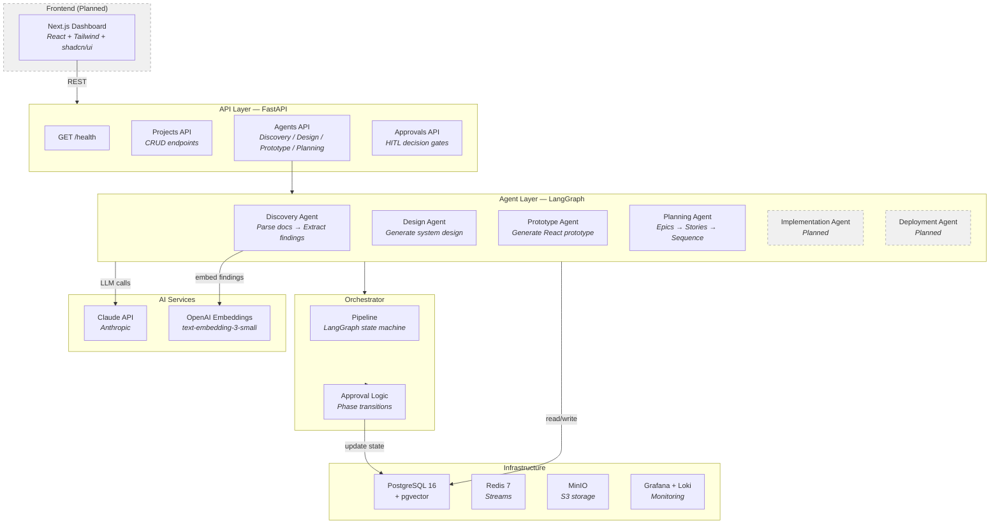
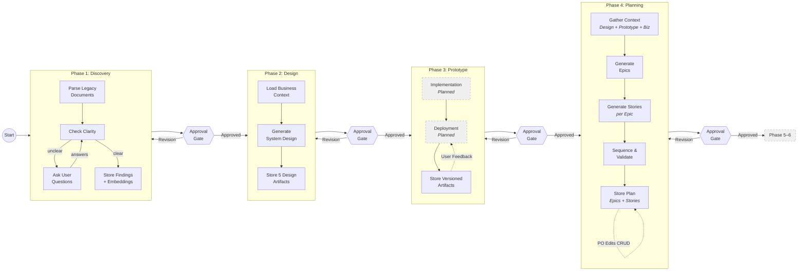
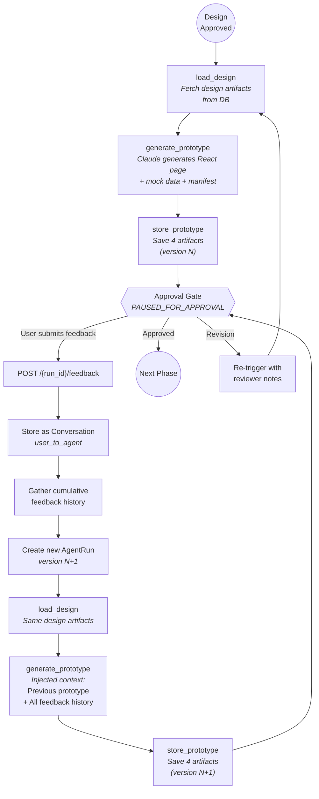
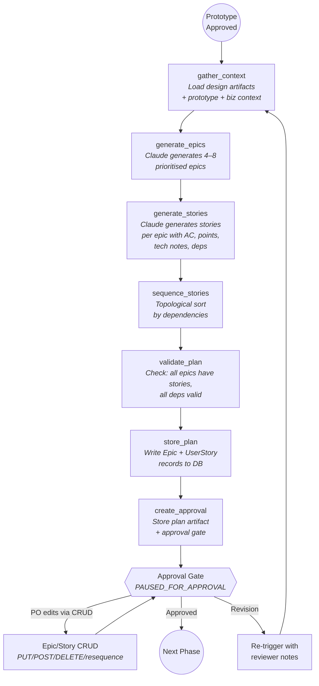
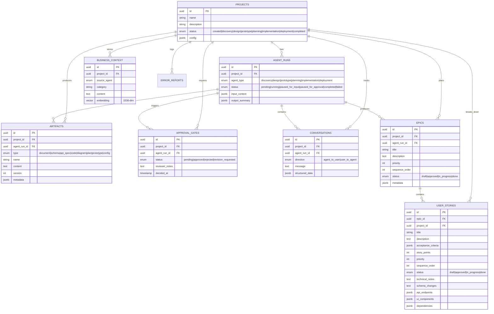
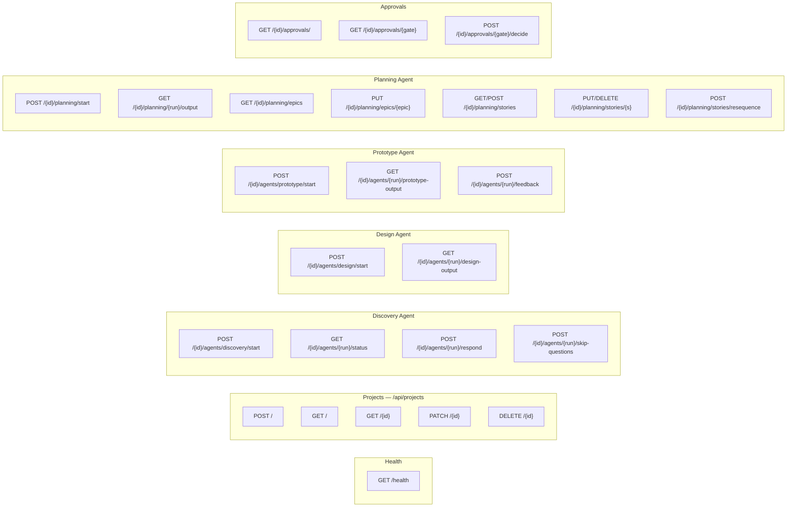
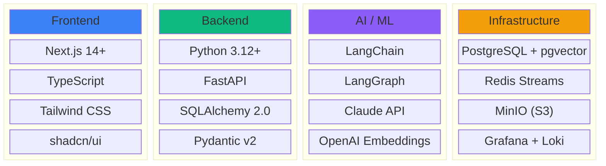
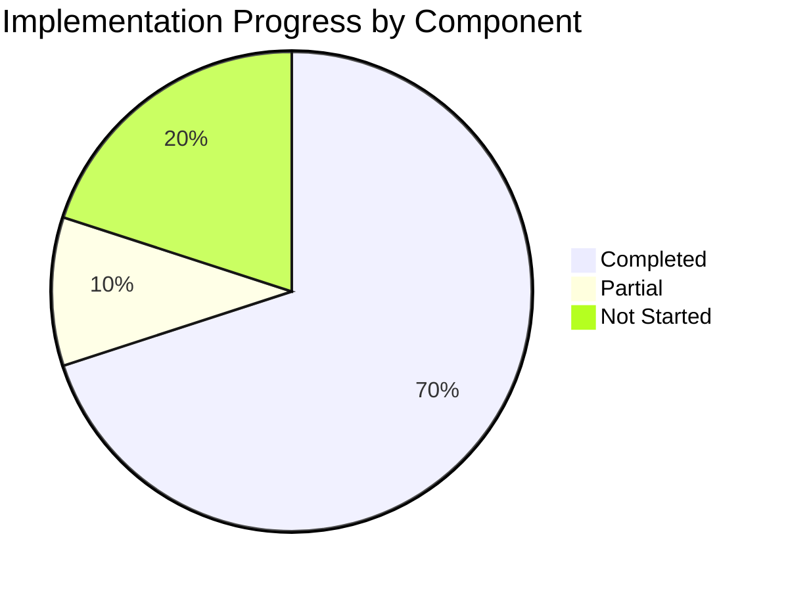

# Agentic SDLC — Architecture Diagrams for Presentation

> Render each Mermaid block at https://mermaid.live — export as PNG/SVG and paste into PowerPoint.

---

## 1. High-Level System Architecture



---

## 2. SDLC Pipeline Flow (End-to-End)



---

## 3. Prototype Agent — Feedback Loop Detail



---

## 4. Planning Agent — 7-Node Pipeline Detail



---

## 5. Data Model (Entity Relationship)



---

## 6. API Endpoints Map



---

## 7. Tech Stack Overview



---

## 8. Implementation Progress



| Status | Components |
|--------|-----------|
| **Completed (14)** | Infrastructure, DB Schema, Config, ORM Models, API Schemas, Project CRUD, Agent Routes, Approval Routes, Planning Routes, Context Store, Embeddings, Discovery Agent, Design Agent, Prototype Agent, Planning Agent |
| **Partial (2)** | Orchestrator Pipeline (~55%), Integration/E2E Tests (~30%) |
| **Not Started (4)** | Implementation Agent, Deployment Agent, Dashboard, CI/CD |

---

## How to Use

1. Go to **https://mermaid.live**
2. Paste any code block above (between the ` ```mermaid ` markers)
3. Click **Actions → Export PNG** (or SVG for crisp scaling)
4. Insert the image into your PowerPoint slide
5. Adjust background to match your slide theme

> Tip: For dark-themed slides, use Mermaid's `%%{init: {'theme': 'dark'}}%%` at the top of any diagram.